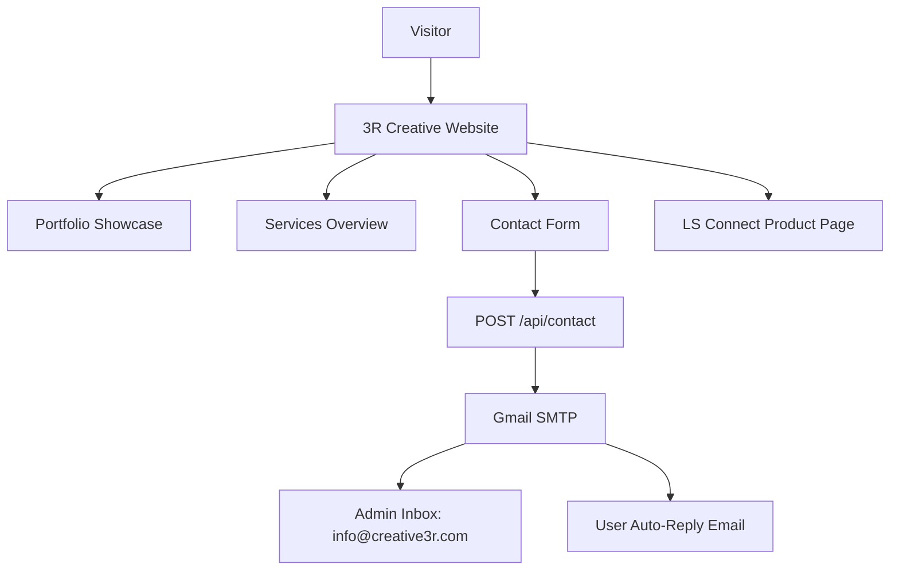
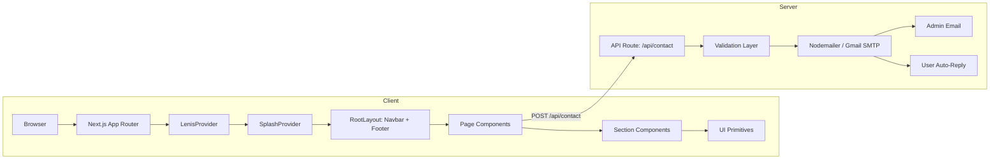
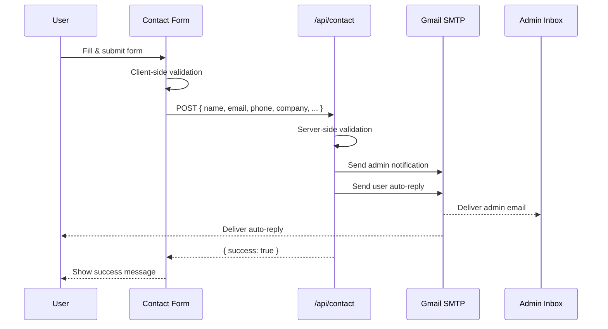

# 3R Creative — Agency Website

> **Reflect. Refine. Resonate.** — A premium creative agency website built for the precious metals, jewellery, gold refinery, and gold trading industries across the UAE and Middle East.

[](https://nextjs.org/)
[](https://www.typescriptlang.org/)
[](https://tailwindcss.com/)
[](https://greensock.com/gsap/)
[](./LICENSE)

---

## Table of Contents

- [Project Overview](#project-overview)
- [Features](#features)
- [Tech Stack](#tech-stack)
- [Architecture](#architecture)
- [Folder Structure](#folder-structure)
- [Installation](#installation)
- [Configuration](#configuration)
- [API Documentation](#api-documentation)
- [Database](#database)
- [Usage](#usage)
- [Deployment](#deployment)
- [Future Improvements](#future-improvements)
- [Contributing](#contributing)
- [License](#license)

---

## Project Overview

**3R Creative** is a full-stack creative agency website that showcases the company's portfolio, services, team, and brand philosophy. The agency specialises in serving clients within the precious metals, jewellery, gold refinery, and gold trading industries, primarily across the UAE and Middle East.

The name and tagline — **Reflect. Refine. Resonate.** — represent the company's three-stage creative process:

| Stage | Meaning |
|---|---|
| **Reflect** | Uncovering the authentic story behind a brand |
| **Refine** | Crafting that story into polished, high-quality creative output |
| **Resonate** | Ensuring the work connects with target audiences and drives results |

The site also hosts a dedicated product page for **LS Connect**, a WhatsApp Business Platform solution for managing customer conversations at scale.



---

## Features

### Public-Facing

- **Animated Hero Section** — Full-width video background with a 3D rotating service carousel and floating GSAP-animated UI elements
- **Parallax Portfolio Grid** — Horizontally draggable, two-row parallax grid showcasing 6 client projects
- **Dynamic Portfolio Detail Pages** — Rich, section-based project pages with image lightboxes, scope cards, impact metrics, and Previous/Next navigation
- **Services Catalogue** — 10 categorised services with descriptions and sub-items, including cursor-following interactive elements
- **Team / Why Choose Us Section** — Values-driven section highlighting the agency's differentiators
- **Contact Form with Email Delivery** — Validated multi-field form with a searchable international phone input; submissions deliver an admin notification and a user auto-reply via Gmail SMTP
- **About Page** — Video hero with scroll-triggered GSAP animations and brand value declarations
- **LS Connect Product Page** — Full WhatsApp Business Platform SaaS landing page with feature showcase, dashboard preview, and campaign/template management examples
- **Smooth Scroll** — Site-wide smooth scrolling via Lenis, synced with GSAP ScrollTrigger
- **Custom Cursor** — Interactive cursor that responds to hover states across the site
- **Splash Screen** — Animated loading screen on first visit
- **Responsive Design** — Mobile-first layout with breakpoints across all screen sizes
- **Hover Sound Effects** — Subtle audio feedback on interactive elements

### Technical

- Next.js App Router with server-side API routes
- TypeScript throughout with strict mode enabled
- HTML entity escaping in emails to prevent XSS
- Environment variable validation with 503 fallback if misconfigured
- Scroll-aware navbar (hides on scroll-down, reappears on scroll-up, blurs on scroll)

---

## Tech Stack

| Category | Technology | Version |
|---|---|---|
| **Framework** | Next.js (App Router) | 16.1.1 |
| **UI Library** | React | 19.2.3 |
| **Language** | TypeScript | 5 |
| **Styling** | Tailwind CSS | 4 |
| **Animation** | GSAP + ScrollTrigger | 3.14.2 |
| **Smooth Scroll** | Lenis | 1.0.42 |
| **Icons** | Lucide React | 0.563.0 |
| **Email** | Nodemailer | 8.0.1 |
| **Linting** | ESLint | 9 |
| **CSS Processing** | PostCSS + @tailwindcss/postcss | 4 |
| **Runtime** | Node.js | 20+ |

**External Services:**

| Service | Purpose |
|---|---|
| Gmail SMTP | Contact form email delivery |
| flagcdn.com | Country flag images in phone number input |

---

## Architecture

The application follows the **Next.js App Router** architecture pattern with a clear separation between UI components, page layouts, providers, and API routes.



### Contact Form Data Flow



### Portfolio Navigation Flow

```mermaid
flowchart LR
    A[/portfolio] -->|Click card| B[/portfolio/:id]
    B --> C{Render Content Sections}
    C --> D[Default: Text + Images]
    C --> E[Bullets: Dot list]
    C --> F[Scope: Grid cards]
    C --> G[Impact: Badge metrics]
    C --> H[Logo: Featured image]
    B -->|Prev / Next| B
```

---

## Folder Structure

```
creative3r/
│
├── app/                              # Next.js App Router root
│   ├── layout.tsx                   # Root layout (fonts, providers, Navbar, Footer)
│   ├── page.tsx                     # Home page
│   ├── globals.css                  # Global Tailwind CSS
│   │
│   ├── about/
│   │   └── page.tsx                 # About page (video hero, brand values)
│   ├── contact/
│   │   └── page.tsx                 # Standalone contact page
│   ├── services/
│   │   └── page.tsx                 # Services page
│   ├── teams/
│   │   └── page.tsx                 # Team showcase page
│   ├── privacy-policy/
│   │   └── page.tsx
│   │
│   ├── portfolio/
│   │   ├── page.tsx                 # Portfolio gallery grid
│   │   ├── portfolioData.ts         # Static data for all portfolio projects
│   │   ├── PortfolioGridCard.tsx    # Card component for the grid
│   │   ├── PortfolioMedia.tsx       # Media player / lightbox component
│   │   └── [id]/
│   │       └── page.tsx             # Dynamic portfolio detail page
│   │
│   ├── ls-connect/                  # LS Connect WhatsApp product section
│   │   ├── page.tsx
│   │   ├── privacy-policy/page.tsx
│   │   ├── terms/page.tsx
│   │   └── data-deletion/page.tsx
│   │
│   ├── api/
│   │   └── contact/
│   │       └── route.ts             # Contact form POST endpoint
│   │
│   ├── components/
│   │   ├── home/                    # Homepage section components
│   │   │   ├── HeroSection.tsx      # Video bg, 3D carousel, floating boxes
│   │   │   ├── PortfolioSection.tsx # Draggable parallax portfolio grid
│   │   │   ├── TeamSection.tsx      # Why choose us / values
│   │   │   ├── ContactSection.tsx   # Embedded contact form
│   │   │   ├── SuperPowers.tsx      # Agency capabilities highlight
│   │   │   ├── Collaborators.tsx    # Client logo strip
│   │   │   └── Testimonials.tsx     # (currently commented out)
│   │   │
│   │   ├── layout/
│   │   │   ├── Navbar.tsx           # Scroll-aware, mobile-responsive nav
│   │   │   └── Footer.tsx
│   │   │
│   │   ├── services/
│   │   │   └── ServiceSection.tsx   # 10-service card grid
│   │   │
│   │   ├── ui/                      # Reusable UI primitives
│   │   │   ├── CustomCursor.tsx
│   │   │   ├── FlipWords.tsx
│   │   │   ├── PhoneInput.tsx       # Searchable country + phone input
│   │   │   ├── ShapeSVG.tsx
│   │   │   ├── SplashScreen.tsx
│   │   │   └── WavyLine.tsx         # Decorative SVG divider
│   │   │
│   │   └── providers/
│   │       ├── LenisProvider.tsx    # Smooth scroll + GSAP ticker bridge
│   │       └── SplashProvider.tsx   # Splash screen context
│   │
│   └── hooks/
│       └── useHoverSound.ts         # Plays tick.mp3 on hover interactions
│
├── public/
│   ├── assets/
│   │   ├── images/
│   │   │   ├── logo.svg
│   │   │   ├── logoName.svg
│   │   │   ├── portfolio/           # Per-project image folders
│   │   │   │   ├── bluediamond/
│   │   │   │   ├── blackmamba/
│   │   │   │   ├── siramamba/
│   │   │   │   ├── promise/
│   │   │   │   ├── signature/
│   │   │   │   └── mac&ro/
│   │   │   └── home/companies/      # Client logo images
│   │   ├── videos/
│   │   │   ├── home/hero-video.mp4
│   │   │   └── about/aboutus-cover.mp4
│   │   ├── sounds/
│   │   │   └── tick.mp3             # Hover sound effect
│   │   └── icon/                    # Social media SVG icons
│   │
│   └── fonts/
│       └── IvyOraDisplay/           # Custom display typeface (weights 100–700)
│
├── next.config.ts                   # Remote image domain allowlist
├── tsconfig.json                    # TypeScript config (strict, path alias @/*)
├── postcss.config.mjs               # Tailwind PostCSS integration
├── eslint.config.mjs
├── package.json
└── .env.local                       # Local env vars (not committed)
```

---

## Installation

### Prerequisites

- **Node.js** >= 20.x
- **npm** >= 10.x (or pnpm / yarn)
- A **Gmail account** with an [App Password](https://support.google.com/accounts/answer/185833) enabled (for contact form email delivery)

### Steps

```bash
# 1. Clone the repository
git clone <repository-url>
cd creative3r

# 2. Install dependencies
npm install

# 3. Set up environment variables
cp .env.local.example .env.local
# Edit .env.local with your credentials (see Configuration section below)

# 4. Start the development server
npm run dev
```

Open [http://localhost:3000](http://localhost:3000) in your browser.

---

## Configuration

All runtime configuration is supplied via environment variables in `.env.local` for local development, or via your deployment platform's environment settings in production.

### Environment Variables

Create a `.env.local` file in the project root:

```env
# ─── Email / SMTP ──────────────────────────────────────────────────────────

# Gmail address used as the SMTP sender (the "From" address)
GMAIL_USER=noreply.yourcompany@gmail.com

# Gmail App Password — NOT your regular Google account password.
# Generate one at: https://myaccount.google.com/apppasswords
GMAIL_APP_PASS=xxxx xxxx xxxx xxxx

# Destination inbox for incoming contact form submissions
CONTACT_RECEIVER_EMAIL=info@yourcompany.com

# Business name used in user-facing auto-reply email copy
BUSINESS_NAME=YourCompanyName
```

| Variable | Required | Description |
|---|---|---|
| `GMAIL_USER` | Yes | Gmail address used as the SMTP sender |
| `GMAIL_APP_PASS` | Yes | Gmail App Password (16-character token) |
| `CONTACT_RECEIVER_EMAIL` | Yes | Inbox that receives contact form submissions |
| `BUSINESS_NAME` | Yes | Business name included in auto-reply email copy |

> **Security Note:** Never commit `.env.local` to version control. The file is already listed in `.gitignore`. If any variable is missing at runtime, the API route returns `503 Service Unavailable` immediately rather than silently failing.

### Next.js Remote Image Domains

[next.config.ts](next.config.ts) explicitly allows images from `flagcdn.com`. This is required for the country flag images rendered inside the `PhoneInput` component. No additional configuration is needed for this.

---

## API Documentation

### `POST /api/contact`

Processes contact form submissions and sends emails via Gmail SMTP.

**Runtime:** Node.js (not Edge Runtime)

#### Request

```
POST /api/contact
Content-Type: application/json
```

| Field | Type | Required | Validation | Description |
|---|---|---|---|---|
| `name` | `string` | Yes | min 3 characters | Sender's full name |
| `email` | `string` | Yes | valid email format | Sender's email address |
| `phone` | `string` | No | — | Phone number digits |
| `phoneCountry` | `string` | No | — | Country code + dial code (e.g. `AE +971`) |
| `company` | `string` | No | — | Sender's company name |
| `hearAboutUs` | `string` | No | enum (see below) | Referral source |
| `projectDetails` | `string` | No | — | Project brief or description |

`hearAboutUs` accepted values:
- `"Social Media"`
- `"Friends & Colleagues"`
- `"Word of mouth"`

#### Example Request Body

```json
{
  "name": "Jane Smith",
  "email": "jane@example.com",
  "phone": "501234567",
  "phoneCountry": "AE +971",
  "company": "Gold Co.",
  "hearAboutUs": "Social Media",
  "projectDetails": "We need a full rebrand for our jewellery line."
}
```

#### Responses

| HTTP Status | Body | Condition |
|---|---|---|
| `200 OK` | `{ "success": true }` | Both emails sent successfully |
| `400 Bad Request` | `{ "error": "<message>" }` | Validation failed (missing or invalid fields) |
| `500 Internal Server Error` | `{ "error": "<message>" }` | SMTP delivery failure |
| `503 Service Unavailable` | `{ "error": "<message>" }` | Missing required environment variables |

#### Email Behaviour

Two emails are dispatched per successful submission:

1. **Admin notification** → delivered to `CONTACT_RECEIVER_EMAIL`
   - Subject: `New Contact Form Submission from <name>`
   - Dark-themed HTML with all submitted fields
   - `Reply-To` header set to the submitter's email for one-click replies

2. **User auto-reply** → delivered to the form submitter
   - Subject: `We've received your message — <BUSINESS_NAME>`
   - Acknowledges receipt and sets response expectations

> All user-supplied content is HTML-entity-escaped server-side before being rendered in email bodies to prevent XSS attacks against email clients.

---

## Database

This project does **not use a traditional database**. All application content is stored as static TypeScript data:

| Content Type | File Location | Description |
|---|---|---|
| Portfolio projects | `app/portfolio/portfolioData.ts` | TypeScript constant — 5 client projects with sections, images, and metadata |
| Services | `app/components/services/ServiceSection.tsx` | Inline array — 10 service objects with titles, descriptions, and sub-items |
| Brand values | `app/about/page.tsx` | Inline JSX — 3 brand value entries (Reflect, Refine, Resonate) |

**Contact form submissions are not persisted** — they are delivered exclusively to the admin email inbox. There is no ORM, SQL/NoSQL database, or file-based storage in the current implementation.

---

## Usage

### Development

```bash
npm run dev       # Start the dev server at http://localhost:3000 with hot reload
```

### Production Build

```bash
npm run build     # Compile and optimise for production (outputs to .next/)
npm run start     # Start the production server
```

### Linting

```bash
npm run lint      # Run ESLint across all source files
```

### Adding a Portfolio Project

1. Open [app/portfolio/portfolioData.ts](app/portfolio/portfolioData.ts)
2. Add a new object to the exported array following the existing `PortfolioItem` type shape
3. Place project images under `public/assets/images/portfolio/<project-slug>/`
4. The dynamic route `/portfolio/[id]` will pick it up automatically — no routing changes needed

### Adding a Service

1. Open [app/components/services/ServiceSection.tsx](app/components/services/ServiceSection.tsx)
2. Append a new object to the `services` array with `title`, `description`, and `items` fields

---

## Deployment

The project is a standard Next.js application and is designed for deployment on **Vercel** — the native platform for Next.js — with zero additional configuration beyond setting environment variables.

### Vercel (Recommended)

**Option A — Vercel CLI:**

```bash
npm i -g vercel
vercel
```

**Option B — GitHub Integration:**

Connect the repository to a Vercel project via the [Vercel Dashboard](https://vercel.com/dashboard) for automatic deployments on every push to `main`.

**Required environment variables in Vercel:**

Navigate to **Project → Settings → Environment Variables** and add:

| Variable | Environment |
|---|---|
| `GMAIL_USER` | Production, Preview, Development |
| `GMAIL_APP_PASS` | Production, Preview, Development |
| `CONTACT_RECEIVER_EMAIL` | Production, Preview, Development |
| `BUSINESS_NAME` | Production, Preview, Development |

### Other Platforms

| Platform | Notes |
|---|---|
| **Netlify** | Use `@netlify/plugin-nextjs`; set env vars in site settings |
| **Railway / Render** | Build command: `npm run build`; start command: `npm run start`; set env vars in the dashboard |
| **Self-hosted VPS** | Build with `npm run build`, serve with `npm run start`, optionally managed by PM2 |
| **Docker** | No `Dockerfile` is currently present — create one using `node:20-alpine` as the base image, copy the `.next/` output, and run `npm start` |

> **Note:** No `Dockerfile`, `docker-compose.yml`, `fly.toml`, or `netlify.toml` were found in the codebase. Add these files if containerised or platform-specific deployment is required.

---

## Future Improvements

| Area | Suggestion |
|---|---|
| **Testimonials** | `Testimonials.tsx` exists but is commented out — populate with real client testimonials and re-enable |
| **Headless CMS** | Migrate portfolio and services data from static TypeScript files to a CMS (e.g. Sanity, Contentful) for non-developer content management |
| **Lead Persistence** | Store contact form submissions in a database (e.g. Supabase, PlanetScale) in addition to email delivery for a queryable lead pipeline |
| **Analytics** | Integrate Plausible, PostHog, or Google Analytics to track page views, portfolio engagement, and form conversion |
| **SEO** | Add per-page Open Graph images, JSON-LD structured data, and a generated `sitemap.xml` |
| **Blog / Insights** | Add a content section to improve organic search performance |
| **LS Connect Funnel** | The LS Connect product page is currently static — wire up a real sign-up flow or demo-booking integration |
| **Testing** | No test suite currently exists — add Playwright for E2E tests and Vitest for unit/component tests |
| **CI/CD** | Add a GitHub Actions workflow for lint, type-check, and build verification on pull requests |
| **Docker** | Add a `Dockerfile` for portable, containerised deployment |
| **Rate Limiting** | Add rate limiting to `/api/contact` to prevent form spam and email abuse |

---

## Contributing

This is a proprietary agency website. External contributions are not accepted.

For internal team members:

1. Branch from `main` using the naming convention `feature/<description>` or `fix/<description>`
2. Run `npm run lint` and `npm run build` locally before opening a pull request
3. If new environment variables are introduced, document them in the [Configuration](#configuration) section of this README

---

## License

This project is **proprietary and confidential**. All rights reserved by 3R Creative. Unauthorised copying, modification, distribution, or use of this software, in whole or in part, is strictly prohibited.

---

<div align="center">
  <sub>Built with Next.js &middot; Crafted by 3R Creative</sub>
</div>
